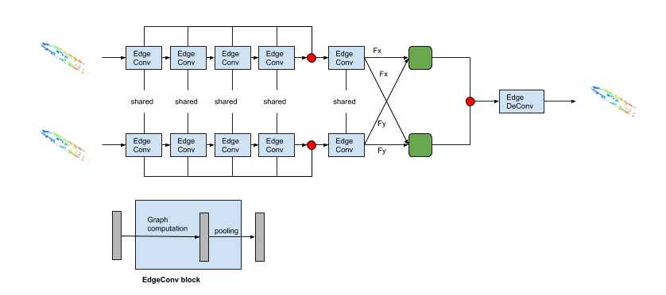
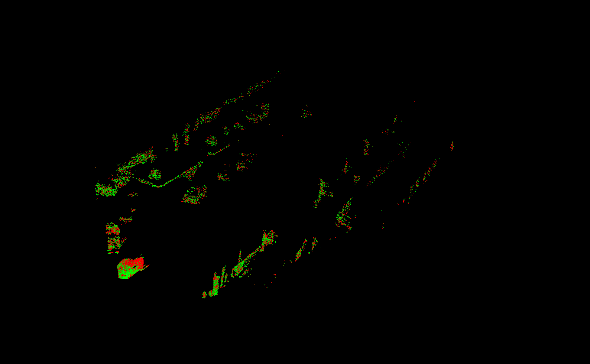

# Deep Cloeset Scene Flow
Introduction to model coming soon!

## Prerequisites 
Install the dependencies into your virtual environment. To do so:
```bash
pip install -r dependencies/requirements.txt
```

If using conda, the evironment has been exported. To create environment from `.yml`:
```bash
conda env create -f dependencies/environment.yml
```
Make sure you install cudatoolkit. The code is highly dependent on CUDA!

Additional requirements for visualization:
```bash
pip install numba
pip install cffi
sudo apt-get -y install python-vtk
sudo pip install mayavi
sudo apt-get install python3-pyqt5
sudo pip install PyQt5
```
## Training Registration

### DCP-v1
```bash
python main.py --exp_name=dcp_v1 --model=dcp --emb_nn=dgcnn --pointer=identity --head=svd
```
### DCP-v2
```bash
python main.py --exp_name=dcp_v2 --model=dcp --emb_nn=dgcnn --pointer=transformer --head=svd
```
## Testing Registration

### DCP-v1
```bash
python main.py --exp_name=dcp_v1 --model=dcp --emb_nn=dgcnn --pointer=identity --head=svd --eval
```
or 
```bash
python main.py --exp_name=dcp_v1 --model=dcp --emb_nn=dgcnn --pointer=identity --head=svd --eval --model_path=xx/yy
```
### DCP-v2
```bash
python main.py --exp_name=dcp_v2 --model=dcp --emb_nn=dgcnn --pointer=transformer --head=svd --eval
```
or 
```bash
python main.py --exp_name=dcp_v2 --model=dcp --emb_nn=dgcnn --pointer=transformer --head=svd --eval --model_path=xx/yy
```
where xx/yy is the pretrained model


## Training Scene Flow
```bash
./run_flow_training.sh
```
## Testing Scene Flow
```bash
./run_flow_testing.sh
```

## Scene Flow Result
